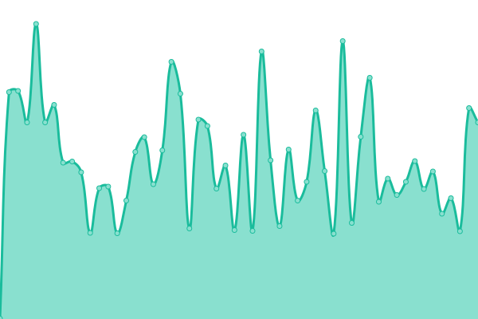
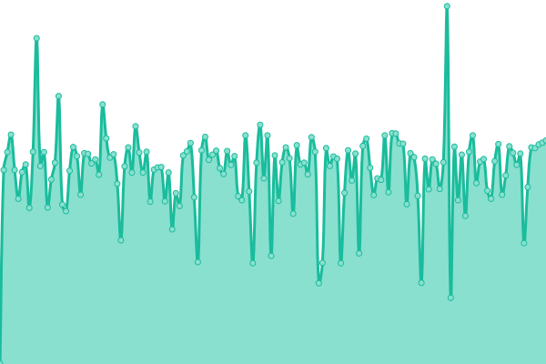

# [📈 Live Status](https://hansluk.github.io/status): <!--live status--> **🟧 Partial outage**

This repository contains the open-source uptime monitor and status page for [hansluk](https://hansluk.github.io/status), powered by [Upptime](https://github.com/upptime/upptime).

With [Upptime](https://upptime.js.org), you can get your own unlimited and free uptime monitor and status page, powered entirely by a GitHub repository. We use [Issues](https://github.com/hansluk/status/issues) as incident reports, [Actions](https://github.com/hansluk/status/actions) as uptime monitors, and [Pages](https://hansluk.github.io/status) for the status page.

<!--start: status pages-->
<!-- This summary is generated by Upptime (https://github.com/upptime/upptime) -->
<!-- Do not edit this manually, your changes will be overwritten -->
<!-- prettier-ignore -->
| URL | Status | History | Response Time | Uptime |
| --- | ------ | ------- | ------------- | ------ |
|  [blog.hansl.uk](https://blog.hansl.uk) | 🟩 Up | [blog-hansl-uk.yml](https://github.com/hansluk/status/commits/HEAD/history/blog-hansl-uk.yml) | 

 593ms
     
 | 

<a href="https://hansluk.github.io/status/history/blog-hansl-uk">100.00%</a>
    

|  nc | 🟩 Up | [nc.yml](https://github.com/hansluk/status/commits/HEAD/history/nc.yml) | 

 1897ms
     
 | 

<a href="https://hansluk.github.io/status/history/nc">100.00%</a>
    

|  books | 🟩 Up | [books.yml](https://github.com/hansluk/status/commits/HEAD/history/books.yml) | 

 548ms
     
 | 

<a href="https://hansluk.github.io/status/history/books">100.00%</a>
    

|  favbkout | 🟥 Down | [favbkout.yml](https://github.com/hansluk/status/commits/HEAD/history/favbkout.yml) | 

 344ms
     
 | 

<a href="https://hansluk.github.io/status/history/favbkout">0.62%</a>
    

|  wb | 🟩 Up | [wb.yml](https://github.com/hansluk/status/commits/HEAD/history/wb.yml) | 

 1835ms
     
 | 

<a href="https://hansluk.github.io/status/history/wb">100.00%</a>
    

<!--end: status pages-->

[**Visit our status website →**](https://hansluk.github.io/status)

## 📄 License

- Powered by: [Upptime](https://github.com/upptime/upptime)
- Code: [MIT](./LICENSE) © [hansluk](https://hansluk.github.io/status)
- Data in the `./history` directory: [Open Database License](https://opendatacommons.org/licenses/odbl/1-0/)
